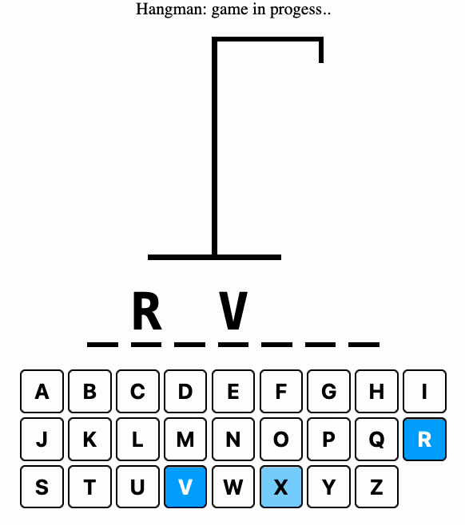

# Hangman Project

## Created using vite react-typescript

To run the cloned project from the home directory in terminal, run following commands:
1. npm i: to install all the dependencies.
2. npm run dev: to run in developer mode

